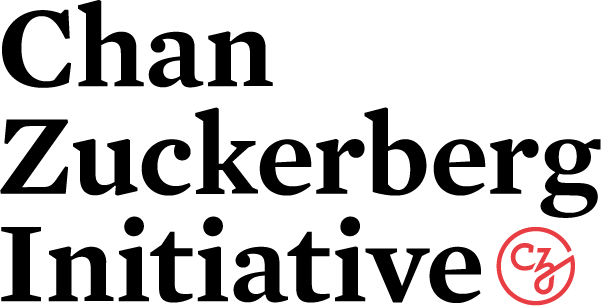

# About us

The Neuroinformatics Unit (NIU) is dedicated to advancing neuroscience research through the development of innovative software and computational tools. We work together to create user-friendly and efficient software for data analysis and management, modelling, and visualization. Our goal is to empower scientists with the tools they need to gain new insights into the complexities of the nervous system and to facilitate collaboration among researchers in the field.

We also develop [training courses](https://software-skills.neuroinformatics.dev/) in using and developing software for neuroscience.

The NIU is based at the [Sainsbury Wellcome Centre](https://www.sainsburywellcome.org/web/) and the [Gatsby Computational Neuroscience Unit](https://www.ucl.ac.uk/gatsby/gatsby-computational-neuroscience-unit) at [University College London (UCL)](https://www.ucl.ac.uk/).

For more information, please read about the [projects we lead](/projects).


```{image} /_static/NIU.jpg
:align: center
:width: 650px
```

## External collaborations
We collaborate with many members of the [UCL Advanced Research Computing Centre](https://www.ucl.ac.uk/advanced-research-computing/advanced-research-computing-centre) to build a 
variety of data processing, analysis and storage tools for neuroscience.

We have an ongoing collaboration with the [Keshavarzi Laboratory](https://www.keshavarzilab.com/) at the University of Cambridge to build tools for data management and analysis.

We work with a number of labs to build anatomical atlases, including 
[Henrik Mouritsen](https://uol.de/en/ibu/animal-navigation/staff/henrik-mouritsen) at the University of Oldenburg and 
[Pascal Malkemper](https://mpinb.mpg.de/en/research-groups/groups/neurobiology-of-magnetoreception/research-focus.html) at the Max Planck Institute for Neurobiology of Behavior – caesar.
## Contact
For help and support with individual tools, or just to get in touch, please use our [Zulip](https://neuroinformatics.zulipchat.com/).

Alternatively, please <a href="mailto:adam.tyson@ucl.ac.uk ?subject=Neuroinformatics Unit">email Adam Tyson</a>.

## Location

<iframe src="https://www.google.com/maps/embed?pb=!1m18!1m12!1m3!1d2482.566218885506!2d-0.1403092842295246!3d51.521173779637365!2m3!1f0!2f0!3f0!3m2!1i1024!2i768!4f13.1!3m3!1m2!1s0x48761b290cd61e55%3A0xff71d53b61728860!2sSainsbury%20Wellcome%20Centre!5e0!3m2!1sen!2suk!4v1674043323427!5m2!1sen!2suk" width="600" height="450" style="border:0;" allowfullscreen="" loading="lazy" referrerpolicy="no-referrer-when-downgrade"></iframe>

## Funding


<div class="things-in-a-row-sponsor">
    
    
    
    
    
    
</div>
