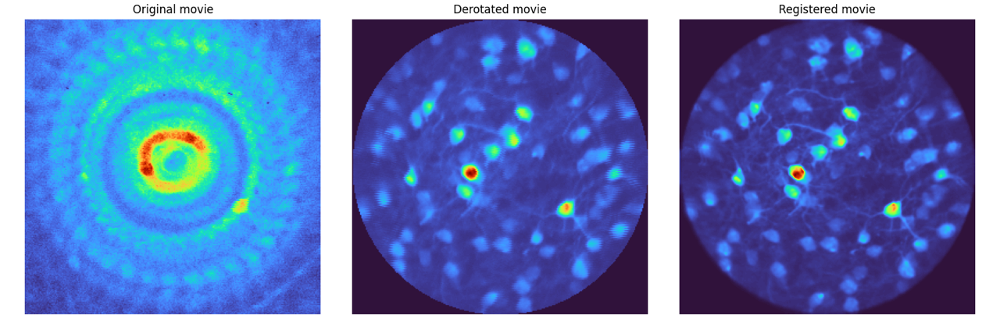
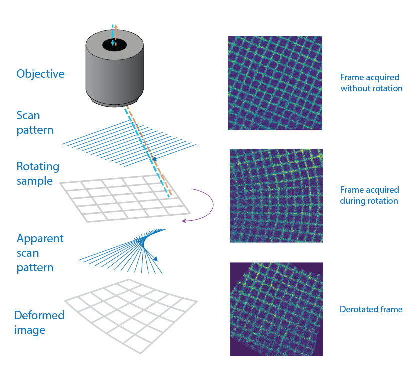
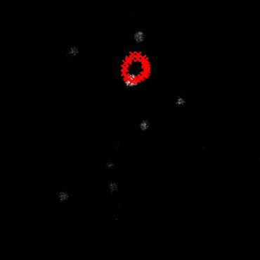

:blogpost: true
:date: July 1, 2025
:author: Laura Porta
:location: London, UK
:category: Blog
:language: English
:image: 1

# `derotation`: a Python package for correcting motion artifacts in rotating multiphoton movies

## Scientific Background

Passive or active rotation of the head (yaw) is an ethologically relevant movement for rodents, enabling them to orient their bodies, avoid obstacles, and locate food sources. In neuroscience, controlled head rotation is a key experimental paradigm for studying the vestibular system and its influence on sensory processing. Electrophysiological recordings have demonstrated the impact of such movements on neural activity in the visual cortex, as shown by [Velez et al. (2018)](https://www.cell.com/neuron/fulltext/S0896-6273(18)30144-2). 

To further connect neural activity to cellular morphology, multiphoton calcium imaging is commonly employed, necessitating the ability to rotate an animal's head under a microscope while acquiring high-resolution movies. This experimental setup introduces significant motion artifacts due to the line-scanning nature of multiphoton imaging, which the derotation package is specifically designed to correct.

---

## Introduction to `derotation`

The `derotation` package provides a robust solution for reconstructing multiphoton movies of rotating samples acquired with a line-scanning microscope at high rotation speeds and low frame rates. When imaging a rotating sample, the line-by-line nature of acquisition introduces significant in-frame geometric distortions, which make later registration not feasible with frame-by-frame derotation methods. This package corrects these artifacts to produce clear, stable movies suitable for standard analysis pipelines like Suite2p.

:::note 
A multiphoton movie is a sequence of 2D images captured over time with a 1-, 2-, or 3-photon microscope.
:::

> **Left**: The mean image of the entire raw 3-photon movie of a rotating sample. **Center**: The mean image after processing with `derotation`. **Right**: The mean image after further registration with Suite2p. The improvement in cell definition is evident after derotation.

---

## Core Functionality: Line-by-Line Correction

The fundamental principle of the package is **derotation-by-line**. Because a line-scanning microscope acquires an image one horizontal line at a time, a rotating sample causes each line to be captured at a slightly different angle. 

> **Left:** schematic of a line-scanning microscope acquiring an image of a grid. The scanning pattern plus the sample rotation leads to fan-like artifacts. **Right:** grid that has been imaged while still (top), while rotating (middle) and the derotated image (bottom). The grid is now perfectly aligned.

If the angle of rotation is recorded simultaneously, the `derotation` package can computationally rotate each line back to a common frame of reference, incrementally building a corrected, distortion-free image.

> This animation demonstrates the line-by-line reconstruction. The distorted frame (left) is corrected one line at a time based on its specific rotation angle to generate the final, stabilized frame (right).

---

## How to Use `derotation`

The package can be used in two primary ways, offering a trade-off between granular control and automation.

### 1. Low-Level Core Function
For direct control, users can call the `derotate_an_image_array_line_by_line` function. This requires two main inputs:
* The raw multiphoton movie (as a NumPy array).
* The corresponding rotation angle for each captured line.

This approach is ideal for users who have already processed their rotation signals and need to apply the core correction algorithm.

:::note
Rotation angles have to be provided from the hardware (such as a step motor) and cannot be inferred from the movie.
:::

### 2. High-Level Pipelines
For an end-to-end workflow, `derotation` provides two pre-built pipeline classes that automate the entire process from raw data to a corrected movie file.

* **`FullPipeline`**: Designed for experiments with randomized rotations. It automatically parses analog signals, interpolates angles, uses Bayesian optimization to find the center of rotation, and performs the derotation.
* **`IncrementalPipeline`**: Tailored for continuous, slow rotations.

Both pipelines generate a corrected TIFF stack, metadata files, and debugging plots.

---

## Finding the Center of Rotation

Accurately identifying the **center of rotation** is critical. An incorrect center will result in residual motion, where stationary objects appear to trace circles in the final movie.

> When the center of rotation is miscalculated, a stationary cell's center (red crosses) will appear to move in a circular path across different rotation angles.

The package implements two methods to find this center:

1.  **Bayesian Optimization**: Used by the `FullPipeline`, this method is computationally intensive but robust. It iteratively tests potential center coordinates to find the one that minimizes motion in the corrected movie.
2.  **Ellipse Fitting**: The `IncrementalPipeline` tracks the path of a bright, stable object (like a cell) across frames. In a physical rotating system, this path would likely form an ellipse. The center of the fitted ellipse is an accurate estimate of the true center of rotation.

---

## Verification and Synthetic Data

To ensure the quality of the correction and validate the algorithms, `derotation` includes tools for generating and processing synthetic data.

* **`Rotator` Class**: This class can take a static image and apply a virtual line-by-line rotation, simulating the distortion from a real microscope.
* **`SyntheticData` Class**: This builds on `Rotator` to create complete, simulated datasets, including fake cell images and corresponding rotation signals.

> An animation showing a synthetic dataset of two "cells" being rotated with line-scanning artifacts.

These tools are invaluable for testing and can even simulate complex cases like **out-of-plane rotations**, where the axis of rotation is tilted relative to the imaging plane. In such cases, the package can fit an ellipse to the object's trajectory to calculate the 3D rotation geometry and apply a more sophisticated correction.

---

## Get Involved

`derotation` is an open-source project in active development. Community contributions are welcome.

* Report bugs or request features: [Open an issue on GitHub](https://github.com/neuroinformatics-unit/derotation/issues)
* Discuss development: [Join the Zulip chat](https://neuroinformatics.zulipchat.com/#narrow/channel/495735-Derotation)

---

## Data Source & Funding
All microscopy data presented here as examples have been acquired with a 3-photon microscope by [Simon Weiler](https://github.com/simonweiler) in the [Margrie Lab](https://www.sainsburywellcome.org/web/groups/margrie-lab).

This project was sponsored by the [Margrie Lab](https://www.sainsburywellcome.org/web/groups/margrie-lab) in the [Sainsbury Wellcome Centre for Neural Circuits and Behaviour](https://www.sainsburywellcome.org/web/) at University College London.

---

## References

Previous work on derotation of calcium imaging movies:
- [Velez-Fort et al., 2018, Neuron](https://doi.org/10.1016/j.neuron.2018.02.023)
- [Hennestad et al., 2021, Cell Reports](https://doi.org/10.1016/j.celrep.2021.110134)
- [Sit & Goard, 2023, Nature Communications](https://doi.org/10.1038/s41467-023-37704-5)
- [Voigts & Harnett, 2020, Neuron](https://doi.org/10.1016/j.neuron.2019.10.016)

This package was inspired by [previous MATLAB script on derotation](https://github.com/jvoigts/rotating-2p-image-correction).
