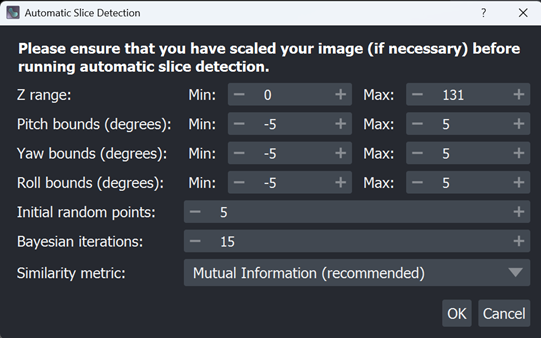
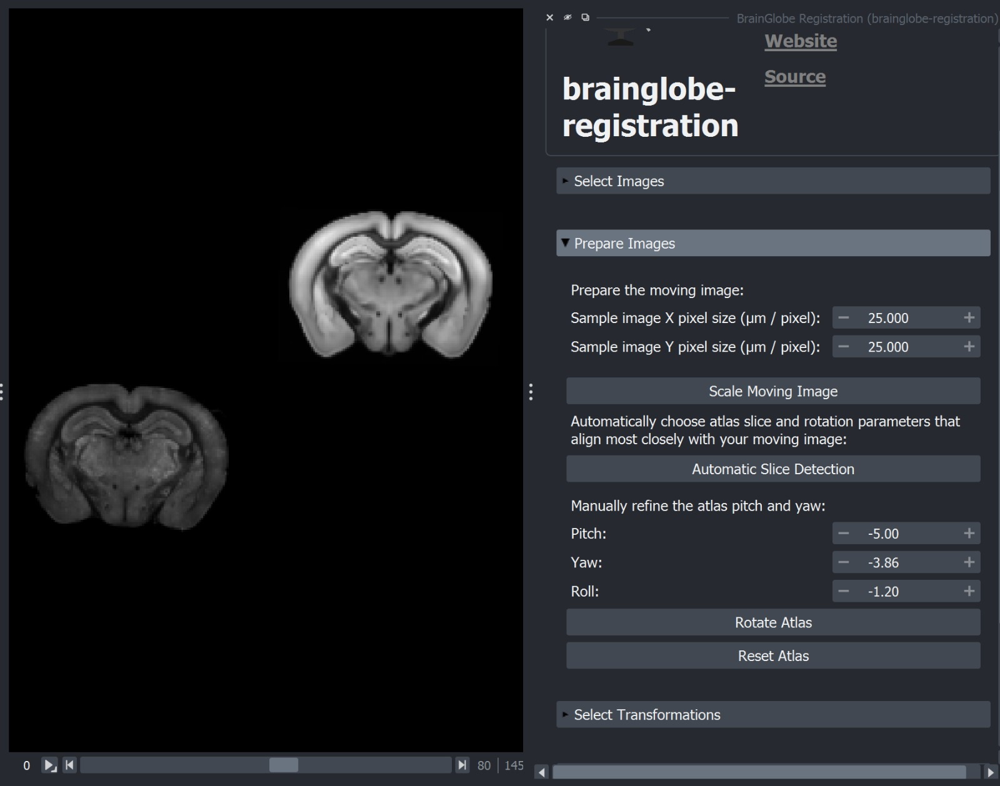

:blogpost: true
:date: August 25, 2025
:author: Saarah Hussain
:location: London, UK
:category: Blog
:language: English
:image: 0

# GSoC 2025: brainglobe-registration

**Project**: [BrainGlobe: Automating Region Selection in brainglobe-registration](https://summerofcode.withgoogle.com/programs/2025/projects/7Xk4Fl7t)  
**Mentors**: [Igor Tatarnikov](https://github.com/IgorTatarnikov), [Alessandro Felder](https://github.com/alessandrofelder), [Adam Tyson](https://github.com/adamltyson)

---

## Introduction

Hi, I'm Saarah. The intersection of healthcare and software development has
always been important to me, which is why spending my summer with the
[Neuroinformatics Unit](https://github.com/neuroinformatics-unit)
has been the perfect opportunity to bring together the work I love.

---

## Project Overview

Over the summer, I worked on extending the 
[`brainglobe-registration`](https://github.com/brainglobe/brainglobe-registration)
plugin, focusing on making atlas alignment more accessible and less 
error-prone for users without a neuroscience background.

Thus far, choosing the correct atlas slice and orientation has been a manual 
task – requiring users to scroll through volumes, make rough visual 
judgements, and enter rotation values by hand. My project aimed to automate 
this step, using 
[`BayesianOptimization`](https://github.com/bayesian-optimization/BayesianOptimization) 
to identify the best matching slice and orientation parameters directly 
from the data.

The result is a new **Automatic Slice Detection widget** in the plugin, which 
not only handles single 2D images but can also align slabs of consecutive 
slices. 

The optimiser identifies the atlas slice and rotation parameters that best 
match the moving image, and then updates the Napari widget accordingly:

For slabs, the optimiser matches the first and last slices and then 
interpolates alignment parameters across the stack, so that users can align 
larger volumes in one go. I have also written detailed 
[documentation](https://github.com/brainglobe/brainglobe.github.io/pull/362/files?short_path=61a3e19) 
outlining exactly how to use these features.

In addition to the core project requirements, I also worked on enhancing the 
project following discussions with my mentors. A key part of this work was 
building **clear and informative logging** – every optimisation step logs 
the parameters tested, its similarity score, the corresponding rotated slice 
image, and the rotation parameters. This makes the process more transparent 
and provides a useful record for reproducibility.

Working on this project has been a valuable experience in bridging methods 
from optimisation and image analysis with practical neuroscience workflows. 
I particularly enjoyed balancing algorithmic design with UX considerations, 
such as keeping the interface intuitive while still exposing enough 
flexibility for advanced use.  

Collaborating with the NIU team also gave me a deeper appreciation of the 
importance of open, well-documented tools in neuroinformatics, and the work 
that goes into making them robust and user-friendly.

Looking back, the most rewarding part was seeing the tool go from concept to 
a usable feature that I hope will save researchers time and difficulty in 
their workflows. Contributing to the BrainGlobe ecosystem has been a greatly 
rewarding opportunity, and I am incredibly excited to see how these tools 
continue to evolve in the future.

---

## Repositories

- [`brainglobe-registration`](https://github.com/brainglobe/brainglobe-registration)
- [`fancylog`](https://github.com/neuroinformatics-unit/fancylog)
- [`brainglobe.github.io`](https://github.com/brainglobe/brainglobe.github.io/)

---

*Thank you to my mentors and the incredible team at NIU for all of their support and guidance!*