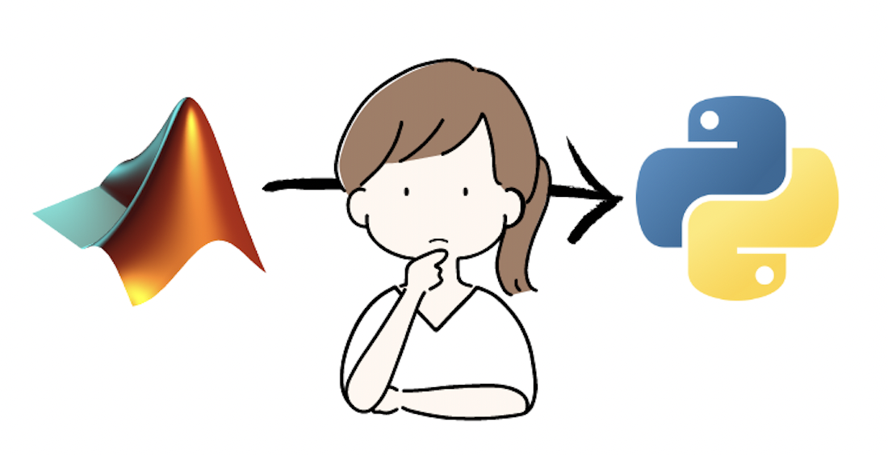

# Why and How to Translate Scientific code from MATLAB to Python: A Guide for Researchers
*Author: Laura Porta*



## Rationale
In the realm of scientific project development, researchers often find themselves grappling with computational challenges that require quick and succinct scripts. These scripts, vital for tasks such as experimental setups and complex data analysis, necessitate a programming language that is both versatile and accessible. For years, MATLAB has been the trusted choice due to its ability to facilitate script creation and its user-friendly interfaces.

Although MATLAB has served scientists faithfully for years, its execution is tied down by its proprietary nature, creating significant limitations. Firstly, the software license can be costly, especially for small institutions or individual researchers. Moreover, the closed-source nature of MATLAB could hamper code sharing and collaboration, which are essential for scientific progress. 

On the other hand, Python, an open-source alternative, is increasingly gaining popularity in the academic world. There are many reasons behind this trend. Python's open-source nature means it is freely available to everyone, which democratizes access. It is also a general-purpose language, meaning it can be used for a wide range of applications, from web development to data science. Python is also the industry standard for machine learning and artificial intelligence, making it a valuable skill for researchers to acquire. 

Given these advantages, there's a rising demand for transitioning code from MATLAB to Python, and we're here to guide you through the process of porting your code efficiently.

## Getting started
When attempting such a translation, it's essential to understand that the process is more than a simple conversion from one language to another. It's an opportunity to optimize and streamline your codebase, leveraging Python's strengths to create a robust and efficient script or application.

Regardless of the code type, it's crucial first to understand the objectives of the original MATLAB script. Sketch out how Python tools might achieve the same results given identical inputs and goals. Drafting a schema or flowchart can prove incredibly helpful in visualizing this translation process.

This is an example schematic that I wrote at the beginning to help me understand how to organize my Python code:

It is quite high-level, but it helped me understand how I wanted to structure my code. The next step was to delve into the original MATLAB codebase to understand its implementation to define which classes and methods I needed to create in Python.
## Navigating the original codebase

### Using the debugger
Once the overall architecture is clear, it's time to dive into the original codebase. A debugger can assist in this exploration, helping you follow the sequence of method calls, inspect parameter inputs, and evaluate their outputs. 

In this way, you can understand which are the real parts of the codebase that do the job, skip the `if-else` statements that never get executed, and discard the classes and methods that are not relevant to your translation. 

### Dependency analyser
For complex codebases, a dependency analyzer can highlight the connections between different files and functions, helping you chart a course through the complexity.

An example of a dependency analyzer is the MATLAB Dependency Analyzer, which can be accessed from the MATLAB IDE. This tool can help you visualize the dependencies between different files and functions, as shown in the image below.

This visualization can help you identify other parts of the codebase that are irrelevant and reduce the scope of your translation.

### Static analysis
You may encounter scenarios where the code you aim to rewrite relies heavily on custom scripts or specific combinations of outdated packages. These dependencies might restrict the execution of the code to the original developer's machine. In such cases, static code analysis becomes an invaluable tool, coupled with a thorough exploration of method documentation and dialogue with the original code's developers and users when possible.

## Plan and write your code
Now that you have fully understood the original codebase, it's time to start designing and writing your Python code.

### Cookiecutter
Before you start writing your code, it's essential to set up a robust and efficient project structure. Cookiecutter is a command-line utility that helps you create a project template for your Python codebase. It can be used to generate a project skeleton, including the directory structure, files, and boilerplate code.

In the Neuroinformatics Unit, we have designed a cookiecutter template, which you can find [here](https://github.com/neuroinformatics-unit/python-cookiecutter).
To use it, you need to install and then run cookiecutter, passing the URL of the template:
```bash
pip install cookiecutter
cookiecutter https://github.com/neuroinformatics-unit/python-cookiecutter
```
### Design and draft your code
Depending on your preference you might want to draw schemas or flowcharts to help you understand how to structure your code. There are many tools you can use to do this, such as [draw.io](https://app.diagrams.net/) or [Miro](https://miro.com/).

The programming paradigm you choose will influence the structure of your code. For example, if you decide to use object-oriented programming, you will need to define classes and methods. In the latter case, you want to spend time in understanding which design patterns are more suitable for your goals. Will your project be released as a package? Will you need to create a GUI? Will you need to create a web application? Design patterns deserve an entire blog post on their own, but for now, I will just mention that the [Refactoring Guru](https://refactoring.guru/design-patterns) is an excellent resource to learn more about them.

In my case, I chose to employ object-oriented programming (OOP) and decided to release my project as a package. To achieve this, I utilized the factory pattern to create my classes. Additionally, my project involved a dashboard, so I implemented the model-view-controller (MVC) pattern to develop the web application. With a clear understanding of the classes and methods I needed, I proceeded to draft them all. Here's an example:
```python
class SF_TF:
    def __init__(self, data: PhotonData, specs: Specifications):
        self.data = data
        self.config = specs

    def get_fit_parameters(self):
        # calls fit_two_dimensional_elliptical_gaussian
        raise NotImplementedError("This method is not implemented yet")

    def responsiveness(self):
        raise NotImplementedError("This method is not implemented yet")

    def get_preferred_direction_all_rois(self):
        raise NotImplementedError("This method is not implemented yet")

    def fit_two_dimensional_elliptical_gaussian(self):
        # calls _2d_gaussian
        # calls _get_response_map
        raise NotImplementedError("This method is not implemented yet")
```
As you can see, the signature of each method is defined, but instead of the implementation, I throw a `NotImplementedError` exception, to remind my future self that I still need to write the code for that method. Comments are also useful to remind me how different methods depend on each other.

By drafting your code in this way you will also have a clear view of the amount of work you need to do. Each implementation can become an issue in your project management tool, and you can assign them to yourself or your team members.

### Write the implementation
Ideally, at this point, you will know what should be the job for each of your methods. You can start writing the implementations by "thinking directly in Python", and use the original MATLAB code just to compare the results.

You will find that for some algorithms, Pythons offers a more concise and elegant solution. For instance, in MATLAB, you might have a `for` loop to iterate over a list of numbers, while in Python you can use a list comprehension.

Matlab iteration
```matlab
numbers = [1, 2, 3, 4, 5];
squares = zeros(size(numbers));
for i = 1:numel(numbers)
    squares(i) = numbers(i)^2;
end
```

Python iteration
```python
numbers = [1, 2, 3, 4, 5]
squares = [number**2 for number in numbers]
```

MATLAB is renowned for its ability to perform complex matrix operations with a single line of code. You might find that indexing of a multidimensional matrix is more verbose in Python, but the NumPy library can help you achieve the same results with a single line of code.

Matlab matrix indexing
```matlab
A = [1, 2, 3; 4, 5, 6; 7, 8, 9];
A(2, 3) = 10;
```

Python matrix indexing
```python
import numpy as np
A = np.array([[1, 2, 3], [4, 5, 6], [7, 8, 9]])
A[1, 2] = 10
```

Remember, translating MATLAB scripts verbatim (with ChatGPT help) might be tempting, but Python's strength lies in its flexibility and its extensive library ecosystem. Embrace Python’s strengths by looking for opportunities to optimize and streamline your code. 

Finally, ensure the validity and efficiency of your Python script by performing comparative testing with the MATLAB version. Libraries like MATLAB Engine API for Python can facilitate this by calling MATLAB functions directly from Python, providing a valuable benchmark for your Python code.

## Conclusion

In conclusion, translating MATLAB scripts to Python is more than a simple conversion process. It presents an opportunity to optimize, streamline, and refine the codebase. While Python may require more verbose code for some operations, the advantages of open-source access, testing frameworks, object-oriented programming, and a powerful suite of libraries more than compensate.

The task may appear daunting, especially for large or complex codebases, but a thoughtful approach—understanding the original script's objectives, planning the Python equivalent, leveraging Python's strengths, and verifying through comparative testing—can ensure a successful translation.

Remember, the goal is not just to replicate functionality, but to create a Python codebase that is robust, efficient, and poised for future development. With careful planning and strategic execution, you can unlock Python's full potential and advance your scientific projects to new heights.


