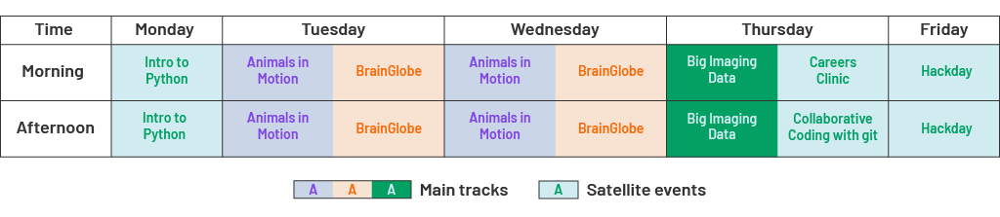
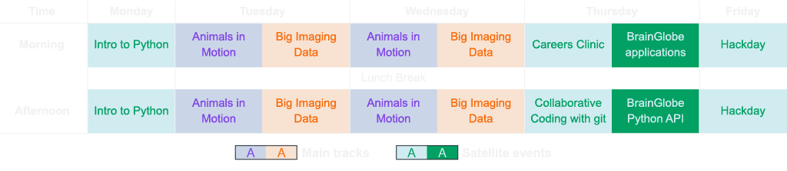

# Open Software Week

We are excited to announce our inaugural **NIU Open Software Week**, taking
place in **August 2025** in **London, UK**. This event will bring together researchers, developers, and users of open-source software for some hands-on training, community-building and hacking.

:::{admonition} Applications are open. Apply for your spot now by filling in [this Google form](https://forms.gle/2UAAzikhSgYArZpX7)!
:class: info

**August 11-15 2025**, [Sainsbury Wellcome Centre](https://maps.app.goo.gl/CzWFFjXJZwX87aMj6)

- **April 16th 2025**: Applications open
- **June 6th 2025**: Applications close
- **End of June/Early July 2025**: Applicants are notified of acceptance
:::

To maximise our impact, we aim to select participants that would benefit the most from the event, and that can bring the experience back to a diverse set of fields. Please be specific in your application and tailor it to the main track(s) that you are planning to attend. Attendance is free of charge (coffee and lunch are provided) and we expect to be able to offer 10-15 travel stipends of between £300 and £1500 for those that make a strong case for attendance and lack alternative funding sources.

## Schedule

Sessions will run daily between **10:00** and **17:00**.
Here is an overview of the whole week:




There are three **main tracks** targeted to different audiences.
We encourage you to read each track's description and choose the one that best fits your interests.
You can apply for at most 2 of 3 main tracks, and note that [Animals in Motion](track-animals-in-motion) and [BrainGlobe](track-brainglobe)
cannot be combined as they are running in parallel.

:::: {grid} 1 1 3 3

:::{grid-item-card} {fas}`video;sd-text-secondary` Animals in Motion
:img-top: ../_static/osw_images/animals-in-motion-card.png
:link: track-animals-in-motion
:link-type: ref

Use open-source tools to track
and analyse animal motion from video footage.

:::

:::{grid-item-card} {fas}`video;sd-text-warning` BrainGlobe
:img-top: ../_static/osw_images/brainglobe-card.png
:link: track-brainglobe
:link-type: ref

Use the BrainGlobe ecosystem of computational neuroanatomy tools
to analyse whole-brain microscopy datasets.
:::

:::{grid-item-card} {fas}`microscope;sd-text-primary` Big Imaging Data
:img-top: ../_static/osw_images/big-imaging-data-card.png
:link: track-big-imaging-data
:link-type: ref

Bridging technical gaps and communities to process and analyse
large 3D imaging datasets with open-source tools.

:::

::::

We also offer a series of **satellite events** which are open to all participants and are designed to provide additional training and networking opportunities.
You can apply for any number of satellite events, but note that the ones on Thursday cannot be combined with the [Big Imaging Data](track-big-imaging-data) track.

:::{dropdown} Intro to Python
:name: intro-to-python
:color: primary
:icon: code-square

A beginner-friendly workshop for those who are new to programming and want to learn the basics of Python before diving into the rest of the week.
:::

:::{dropdown} Careers Clinic
:name: careers-clinic
:color: primary
:icon: briefcase

A discussion for those interested in exploring non-traditional career paths in research, such as Research Software Engineer, Image Analyst, or Data Scientist.
:::

:::{dropdown} Collaborative coding with git
:name: collaborative-coding-with-git
:color: primary
:icon: git-pull-request

Learn how to version control your code and collaborate with others using `git` and GitHub. This workshop is open to all but is especially recommended for those who are planning to participate in the following day's hackathon.
:::

:::{dropdown} Hackday
:name: hackday
:color: primary
:icon: people

Put into practice what you have learned during the week and collaborate with others to tackle a real-world problem using open-source tools. The goal will be to end the day with several pull requests to open-source projects.
:::

## Funding

The [Animals in Motion](track-animals-in-motion) and the [Big Imaging Data](track-big-imaging-data) tracks have been made possible by [Software Sustainability Institute](https://www.software.ac.uk/) fellowships to **Niko Sirmpilatze** and **Alessandro Felder**, respectively. The NIU Open Software Week is further supported by the [Sainsbury Wellcome Centre](https://www.sainsburywellcome.org/). We thank the [Sainsbury Wellcome Centre](https://www.sainsburywellcome.org/) and the [Gatsby Computational Neuroscience Unit](https://www.ucl.ac.uk/gatsby/gatsby-computational-neuroscience-unit) for providing facilities for the event.

```{image} /_static/osw_images/ssi-logo.svg
:align: center
:width: 50%
```

```{toctree}
:maxdepth: 2
:caption: Index
:hidden:

animals-in-motion
brainglobe
big-imaging-data
```
